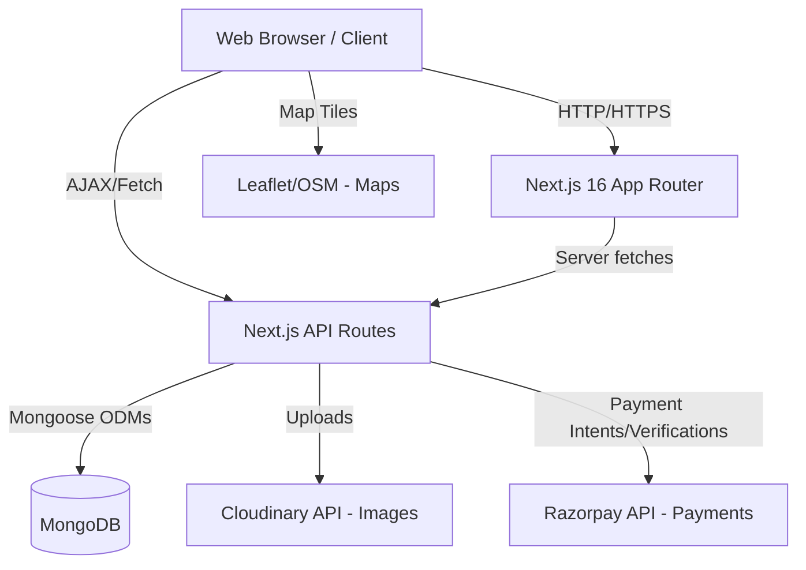
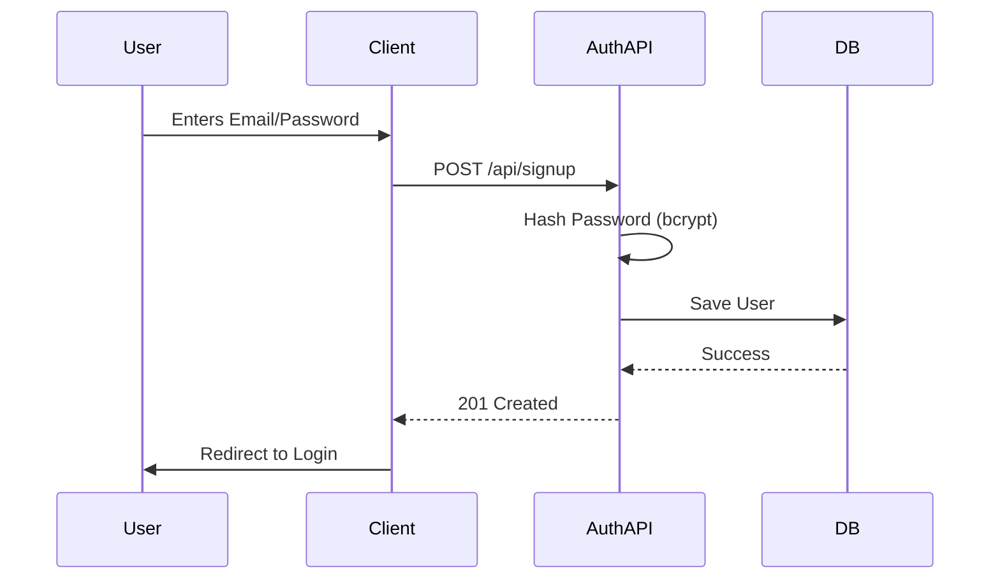
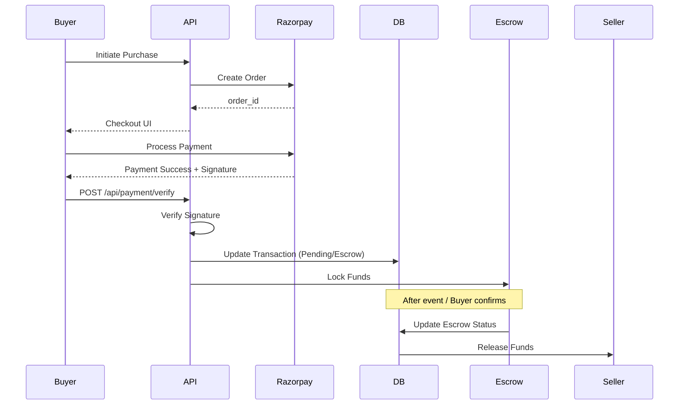
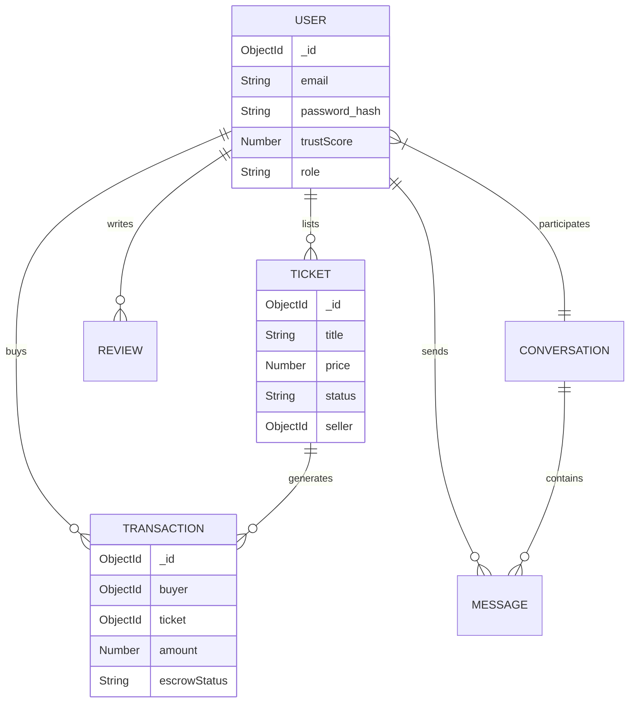

# High-Level Design (HLD) Document
## Ticket Resale Marketplace

## 1. System Architecture Overview

The system follows a modern client-server architecture utilizing Server-Side Rendering (SSR) and Client-Side Rendering (CSR) via Next.js 16 App Router. The backend APIs are co-located within Next.js and communicate with a MongoDB database. External services are used for payments, media storage, and maps.

## 2. Technology Stack & Rationale
- **Frontend Framework:** Next.js 16 (App Router) & React 19. Rationale: Superior SEO, performance through SSR, and unified frontend/backend repository.
- **Styling:** TailwindCSS 4 & Lucide React. Rationale: Rapid UI development and consistent design system.
- **Database:** MongoDB with Mongoose 9. Rationale: Flexible schema for varied ticket types and rapid iteration.
- **Authentication:** NextAuth.js (v4) with JWT. Rationale: Secure, standard-compliant, easy integration with Next.js.
- **Payments:** Razorpay. Rationale: Reliable payment gateway for Indian/Global markets, excellent SDK.
- **Media Storage:** Cloudinary. Rationale: Optimized image delivery, on-the-fly transformations.
- **Data Visualization:** Recharts & Leaflet. Rationale: Interactive analytics and geolocation map integration.

## 3. Component Architecture

### Frontend Components
- **Auth Module:** Login, Signup, Session management.
- **Marketplace Module:** Ticket listing grid, Search bar, Filters, Map View.
- **Transaction Module:** Checkout cart, Payment modal, Success/Failure pages.
- **User Dashboard:** Profile management, Listings manager, Purchase history.
- **Communication:** Chat interface, Notification dropdown.
- **Admin Panel:** Data tables for moderation, charts for analytics.

### Backend Components (API Routes)
- **Auth Service:** Issues and validates JWTs.
- **Ticket Service:** Handles CRUD, search, and inventory management.
- **Transaction & Escrow Service:** Manages payment lifecycles and fund holds.
- **Trust Service:** Calculates and updates user trust scores asynchronously.
- **Messaging Service:** Stores and retrieves chat logs.

## 4. Data Flow Diagrams

### User Registration & Authentication Flow

### Ticket Purchase & Escrow Flow

## 5. API Design Overview
RESTful API principles applied using Next.js Route Handlers.
- `GET /api/tickets`: Retrieve available tickets (Supports query params: category, minPrice, maxPrice).
- `POST /api/tickets`: Create a new listing (Requires Auth).
- `POST /api/payment/create-order`: Initializes a Razorpay intent.
- `POST /api/payment/verify`: Webhook/Frontend callback to verify payment integrity.
- `GET /api/messages/[conversationId]`: Retrieve chat history.

## 6. Database Design (ER Diagram)

## 7. Authentication & Security
- **JWT:** Stored in secure, HTTP-only cookies to prevent XSS.
- **Authorization:** Role-based checks (`user` vs `admin`) enforced at the API route level using middleware.
- **Data Validation:** Zod schemas validate all incoming requests to prevent malformed data and injection attacks.

## 8. Deployment Architecture
- **Hosting:** Vercel (for Next.js frontend and serverless API functions).
- **Database:** MongoDB Atlas (Managed DBaaS).
- **CDN:** Vercel Edge Network & Cloudinary CDN.

## 9. Scalability Considerations
- Serverless API functions automatically scale with traffic.
- MongoDB Atlas allows vertical scaling and read replicas.
- Caching strategies (Next.js ISR/SSG where applicable) to reduce DB load for the homepage and public event pages.
